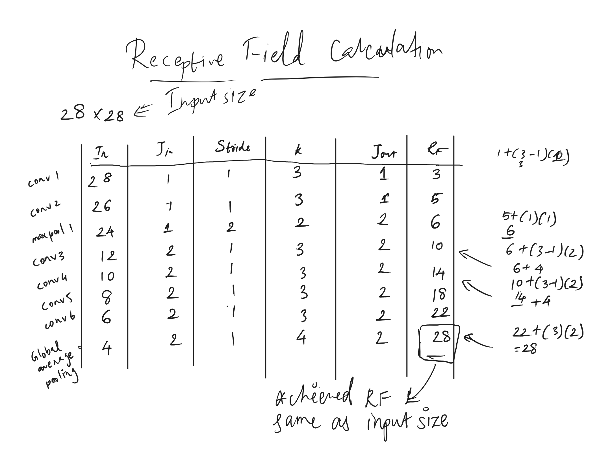
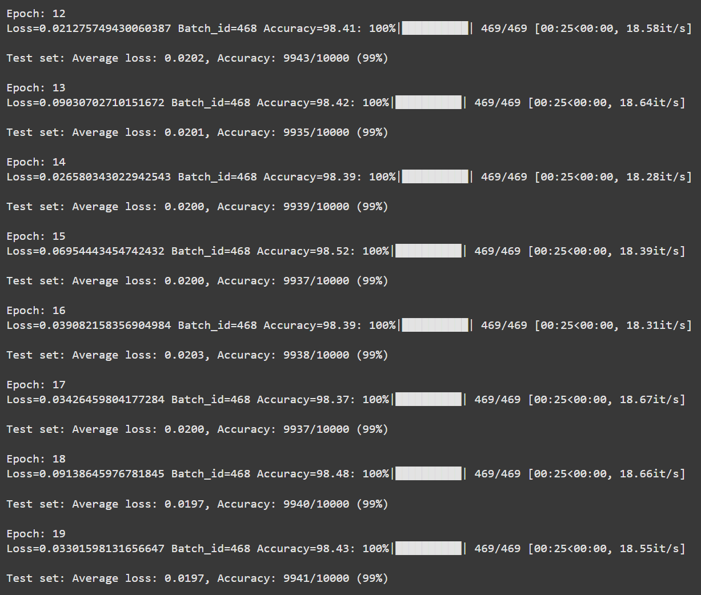

# CNN Model Architecture

## Model Overview
This CNN model is designed for MNIST digit image classification with high accuracy and modern architectural practices.

## Architecture Details

- Convolution Block 1: 
    - Conv2d(1, 16, 3) + ReLU + BN + Dropout 
    - Conv2d(16, 32, 3) + ReLU + BN + Dropout
- Transition block: 
    - Conv2d(32, 16, 1)
- MaxPool(2,2)
- Convolution Block 2: 
    - Conv2d(16, 16, 3) + ReLU + BN + Dropout 
    - Conv2d(16, 16, 3) + ReLU + BN + Dropout
    - Conv2d(16, 16, 3) + ReLU + BN + Dropout
    - Conv2d(16, 16, 3) + ReLU + BN + Dropout
- Global Average Pooling (4 x 4)
- Output block: 
    - Conv2d(16, 10, 1) 
    - Softmax

## Receptive Field Calculation

Final Receptive Field: 28 x 28

## Key Features
1. Uses Batch Normalization after each convolution layer (for non-transition block).
2. Implements Dropout (0.1) for regularization.
3. Uses Global Average Pooling to reduce parameters.
4. Total parameters < 20,000 

## Testcases added in Github Actions
1. Total Parameter Count Test
2. Use of Batch Normalization
3. Use of DropOut
4. Use of Fully Connected Layer or GAP

## Results

